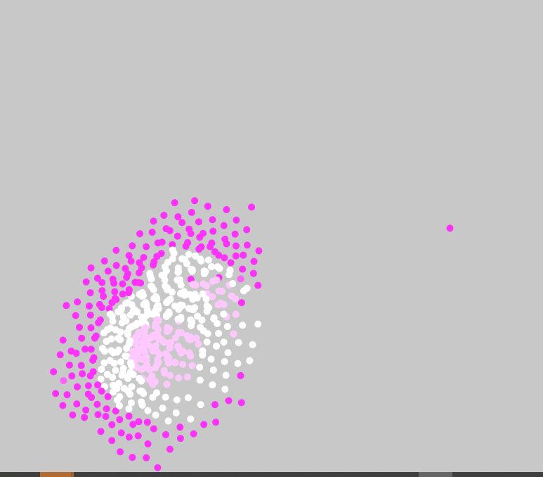

## Describe what decisions you made in implementing the above ##

The approach I took in addressing the evolution aspect of the assignment was thinking about camouflage and flipping that concept whereby the objects that camouflaged the best are the objects that got eliminated whereas the ones that stood out the most survived. This idea was born from my not being able to figure out how to delete objects from the screen in which case I thought a satisfying equivalent to the elimination requirement of the assignment to be simply not being able to see the onject under some conditions. To stand out, an object is meant to be a certain distance away from the flock, if it approaches a distance too close to another object then it gets extinct. 

picture showing some objects having "died" (images being camouflaged)

## Describe your criterion for survival ##

I set reproduction to happen whenever the objects were at a very specific distance from each other with a twist. Instead of killing off objects and recreating them, I made further consistent use of the camouflage idea and extended it to rebirth where the objects that were made to disappear because of the camouflage effect of the colors reappeared/were reborn at the reassembly of the objects at a certain distance apart. In summary, the objects are not being destroyed and reproduced, rather, they are coming in and out of sight by changing colors to and away from the color of the background.

Picture showing all the objects when background is a different color

## Describe what you included in your DNA ##
In my DNA I included the object size and color because I found that based on the criteria I set up for survival, these two actors are the most primary factors that affect appearance and disappearance as well as proximity. I was not able to set up evolution in any way so I simply allowed each object to have its own set of attributes from the DNA not derived from any pre-existing object.

