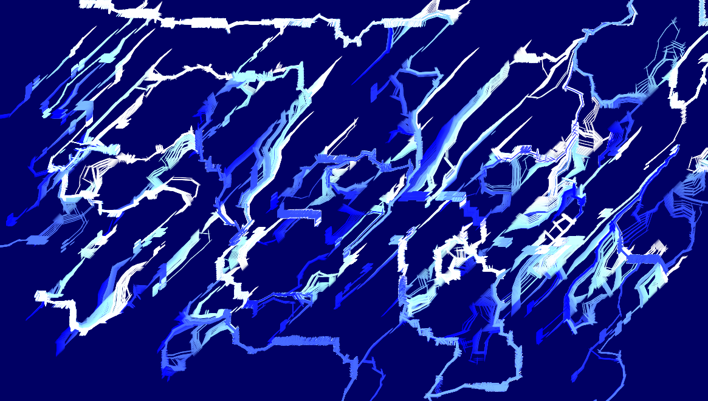

## INSPIRATION ##

I wanted to recreate the below painting in ways that were unique to me while also experimenting with creating flow fields and what changing different variables did to the output. I had a weird inclination to make this work "original" so I did not refer to any of the code used by this arist;instead, I thought about what it would require to build this based on the material covered in class. 

## PROCESS AND DIFFICULTIES ##

The process wasn’t as straight forwards as I assumed it would be. I needed to first create the shape of my brush, then re-learn array lists, select color palates and figure out what flow field construction produced a result that most resembled a painting while not having cuts and creases. The major difficulty in all of this was creating an intentional Perlin flow filed. I am not very comfortable with working with angles so getting the field to behave even remotely the way I wanted was very difficult. I addressed this issue by shifting focus away from the specifics of the angles to the parameters surrounding the angles. I experimented with the offsets as well as doing multiplications on the angles. I also played around with brush thickness, number of objects as well as the position of objects until I found combinations that I thought were beautiful

•	Any image of your finished assignment

## INTERESTING THINGS I LEARNT ##

I was very fascinated to see that the lag that comes into the processing running window when too many elements are in play has so much potential in the animating of a piece. When I started experimenting with 1000+ vehicles, after a certain point the vehicles appearing begun to lag and that caused the pieces to appear as though they were viscous liquids. I will probably be using this effect more consciously in the future

## QUESTIONS ##

The only question I have is how to manipulate the angles in the Perlin flow fields to be able to create desired patterns and how to leave less to chance.

