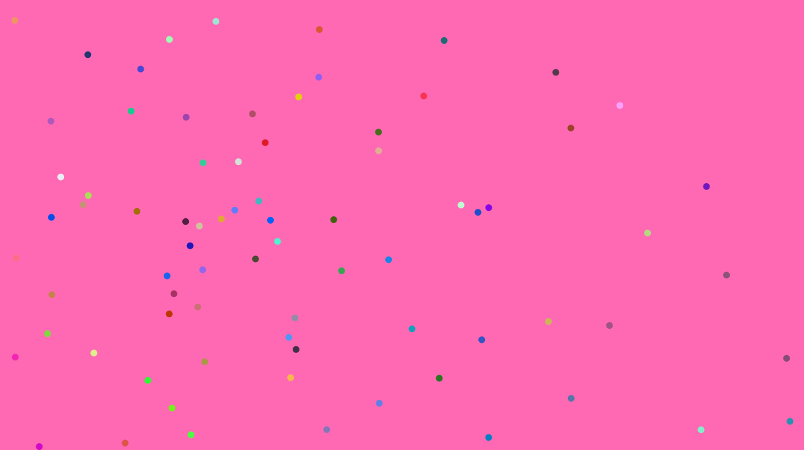

## Describe what decisions you made in implementing the above

My project is a game that allows a user to play around with multiple bubbles flowing smoothly across the screen in order to de-stress. The bubbles follow the cursor and interact with each other in the presence of steering and repulsion forces. To accomplish the evolution, elimination, and re-generation requirements I did the following.

Final product

### Evolution

For evolution I included a mutation object in the DNA class. This object collected the DNA of the object that just died and changed the color to a color very close to the color of the dead object. I made the color the change that occurs during evolution because I felt changes in any other area resulted into the calmness of the program which is the entire premise. A snippet of the code showing mutation can be seen below:

### death

To accomplish death, I set up a function that checks for the object that satisfies the death requirement (going beyond the edged of the canvas) then runs a reverse loop on the array list of bubbles that finds and deletes the dead bubble.

### regeneration

The position of the regenerated objects was set to appear randomly and to be of the same quantity as the object that died. 

## Describe what you included in your DNA

My DNA includes the float variable for object radius, float variable for object initial maximum steering force, float variable for object initial maximum speed of the bubbles, float variable for object initial energy that stores the object’s initial energy in the case that I decide to shift survival criteria to object energy content, float variable for object metabolism, float variable for object deadAt (location of death of object), Float variable for object shade of red, Float variable for object shade of green, Float variable for object shade of blue.

##  Describe your criterion for survival, removal, and regeneration

The criteria for survival was simply making sure the bubble didn’t go past the canvas width and height, the criteria for death was whether or not the object had gone beyond canvas width and height. Checking for this is done in this snippet of code:

The criteria for evolution was simply checking if an object had died and if the user had enabled regeneration (accomplished by pressing the uppercase letter B)

## Describe any problems

The biggest problem I encountered was declaring the object colors through the color variables in the DNA. I was unable to pass them in when printing out an object as with all the other variables. I worked around tis by prescribing the values of these variables in the DNA class directly

## Describe any simplifications you had to make to meet the deadline

I set out to create a program that would allow you to paint on a blank canvas using many small brushes to produce visually appealing paintings. However, as the project evolved I found that the work created by such a program were not particularly appealing as seen here:

However, when testing the project, I often ended up having background enabled in the draw to simplify debugging. When the background was enabled I had a lot of fun playing with the bubble-like objects that were the brush head. I found this very calming and so I decided to turn this project into a project that allows the user to play with bubbles as a de-stress tool. I added ambient music and soft colors and I was happy with what I had created. The final product is as seen below:

Start Page

De-stressing bubbles

