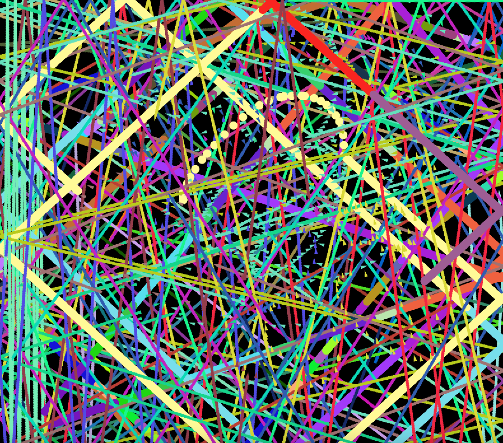
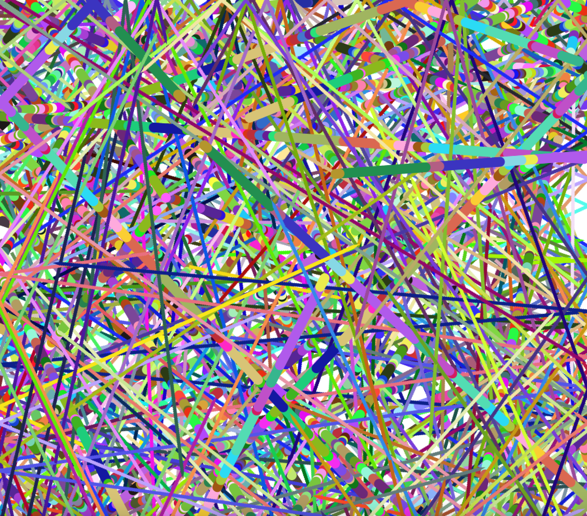
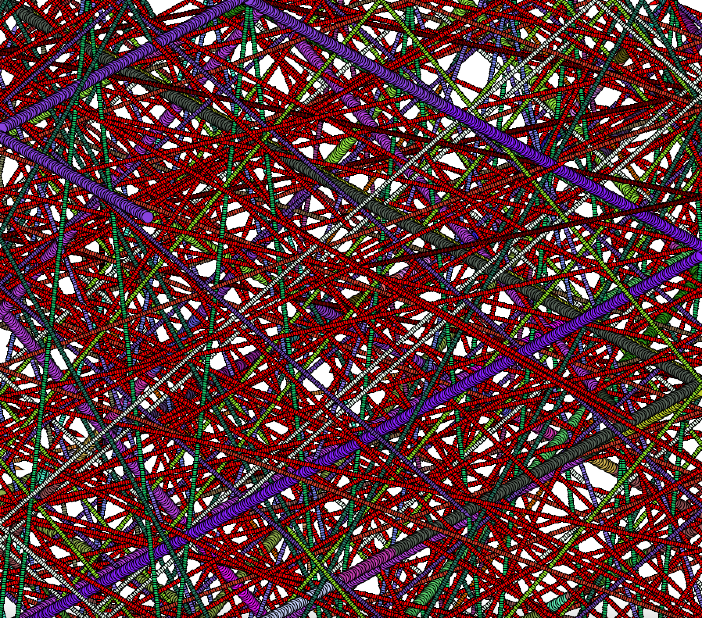
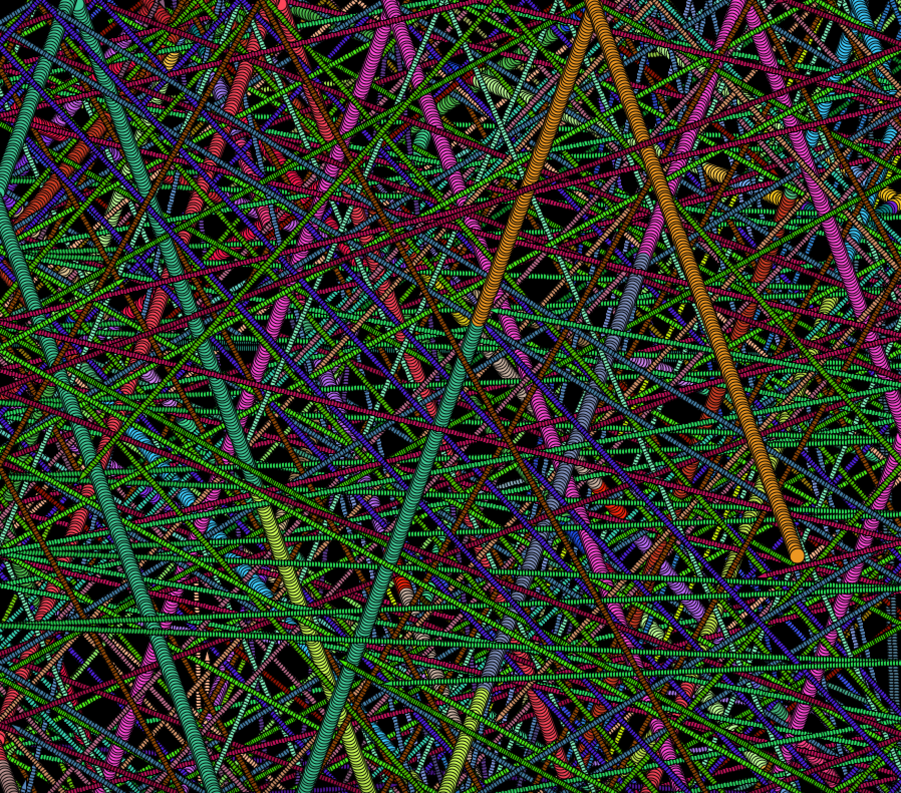

## Project Idea

# Link to video description
[https://drive.google.com/file/d/1EI7PzpLDe44i0abH-mxYXzPZ1J2La3aX/view?usp=sharing]

# What does curiosity look like?
I was very inspired by a conversation we had in class about a reading that presented a robot as being curious and I started thinking about how curiosity can be coded. I ,thus, built a system that has curiosity coded into it. In essence, my project is translating human experience into code and I have used all that we have learnt in class so far, particularly mutation and association to accomplish this as described below. In presenting this code, I translated curiosity into paintings created by running the code that answer the question: what does curiosity look like?

## Implementation 

After reflecting a lot on what curiosity is, using African literature as my primary source of inspiration, I came to the following conclusions: 

-Curiosity requires selective interest on a specific thing.

-Curiosity is based on context; your surroundings influence what you are curious about.(Random objects on the screen)

-Curiosity can be essentialized as a series of questions about a specific thing.(Main character reading objects DNA)

-Curiosity is investigative; it is naturally followed by trying to find answers.(Main character working with object DNA)

-Curiosity is often accompanyied by change in the way we think and act.(Main character mutating from DNA encountered)

-Curiosity is accompanied by free will; we sometimes choose what we are curious about why we choose this can either be random or predetermined depending on whose philosophy one susbscribes to.(Randomness in how the move(random flowfield for randomness and predeterminedness by how objects die after the main character encounters them)

-Curiosity is infinite, you never stop being curious.(Adding a feature that adds objects to be curious about) 

To demonstrate this, I built a system similar to the evolution project where when certain conditions are met by a vehicle's surroundings (the surroundings being other vehicles and other variable elements), and depending on what those conditions are, the vehicle asks questions and investigates the data about these elements. This is done to generate answers that will be outwardly reflected as a mutation of the inquisitive vehicle (this mutation being changing the color of the vehicle). Once this mutation happens, the vehicle will no longer ask the same questions when similar conditions happen again(because it has learned) and instead either ask different questions or become unfazed by these conditions and instead look at other conditions in its context and ask questions about that. In code, this is translated as the object that caused a mutation being removed so the main object does not encounter it again.

I implement free will by randomizing the focus on the vehicle. This randomness will be the random flowfield that also showcases predeterminedness by how objects die after the main character encounters them.

## Presentation
After creating the code, I achieved the following results:

## Challenges
I did not face any serious challnges with this project ouside of the occasional syntax error. Because I had a lot of creative freedom in my translation of curiosity, I utilized areas of code that I was comfortable with doing and learning to complete the project making the process enjoyable and without a lot of difficulties.

## Notes for the future
I am concerned that my approach to curiosity and what it means is too simplistic. I will, thus, do a little more reading on the science and philosophy of curiosity.

